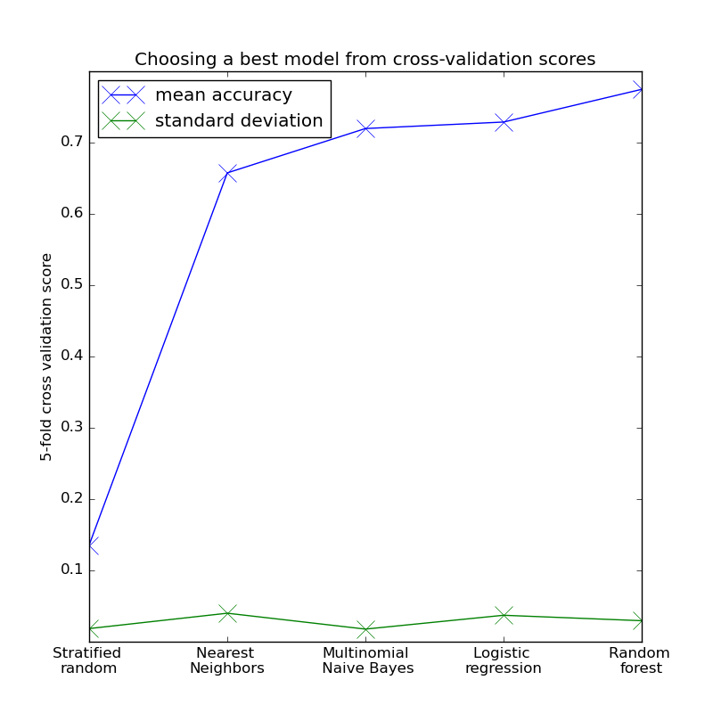
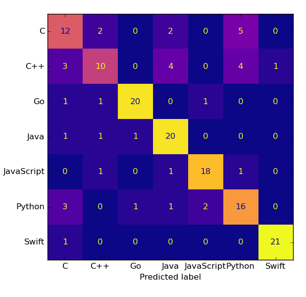

# Predicting GitHub repo language from READMEs
---
### An NLP project by James Allen, Carolyn Davis, Elihezer Lopez, & Steven Newton, Cooperative Analysts of Noteworthy Data, Languages, & other Esteemed Subjects (CANDLES)

---
- [Executive Summary](#executive-summary)
- [Data Dictionary](#data-dictionary)
- [Data Science Pipeline](#data-science-pipeline)
- [Results](#results)

# Executive Summary

## Goal:
- Build a model that can predict the programming language of a repository on Github, given the text of the README file.

## Takeaways:
- Identified 7 Coding Languages (C, C++, Go, Java, JavaScript, Python, Swift)

- Baseline Accuracy of 14%

- Modeled KNN, Logistic Regression, Naive Bayes, and Random Forest using vectorization

- Best Model: Random Forest with depth = 20 had an accuracy of  75%

## Deliverables:
- A well documented Jupyter Notebook containing our group analysis

- Google slides suitable for a general audience that summarize your findings. Include a well-labelled visualization in your slides.

# Data Dictionary

| Column        | Description          | Type   |
| ------------- |:--------------------:|:------:|
| repo          | name of repository   | object |
| language      | coding language      | object |
| readme        | text from readme     | object |
| words         | word count in readme |  int64 |
| lang_freq     | language frequency   |  int64 |

# Data Science Pipeline

## Planning
- The group took a look at the trending repositories on Github and then used that list built a dataset from. 

## Acquire
- The necessay python code was written to extract the text of the README file for each page, and the primary language of the repository and stored in an acquire.py file.

## Prepare
- A prepare.py file was created with functions to process the README text data and store as a .csv 

## Explore
- Explore the data scraped from Github trending repositories:

    - What are the most common words in READMEs?
    
    - What does the distribution of IDFs look like for the most common words?
    
    - Does the length of the README vary by programming language?
    
    - Do different programming languages use a different number of unique words?

## Modeling

- Transform your documents into a form that can be used in a machine learning model. You should use the programming language of the repository as the label to predict.

- Try fitting several different models and using several different representations of the text (e.g. a simple bag of words, then also the TF-IDF values for each).

Classification models used:

* Stratified random (baseline)
* Naive-Bayes
* Logistic regression
* k-nearest neighbors
* Random forest

*Figure 1.* Plot of the best 5-fold cross-validation scores after performing a grid search on various TF-IDF vectorizer and classification model hyperparameters. A random forest model performed best.

- Build a function that will take in the text of a README file, and tries to predict the programming language.

# Results

Performance on test data.

| model         | F1 |       accuracy    | support |
| ------------- |:-----------:|:--------:|:--------:|
| Stratified random  | .12     | .12     | 155 |
| Random forest      | **.75** | **.75** | 155 |

*Figure 1.* Confusion matrix showing performance of best random forest model across all seven classes. Swift and Go languages had the highest F1 scores while C and C++ had the lowest. 

# Conclusion
- 7 coding languages

- Baseline Random 14%

- Model Random Forest Depth = 20 

- Accuracy of 75%

## To Recreate This Project

- You will need your own env file with database credentials along with all the necessary files listed below to run the final group project notebook.

- Read this README.md

- Make a github personal access token:
1. Go here and generate a personal access token https://github.com/settings/tokens

2. Save it in your env.py file under the variable `github_token` 

3. Add your github username to your env.py file under the variable `github_username`

- Download the group notebook, acquire.py, and prepare.py files into your working directory

- Run the final group notebook and adjuct parameters as desired

## Sources
- https://github.com/trending
